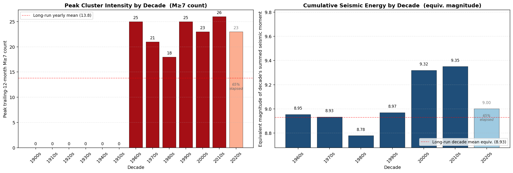
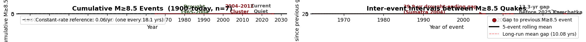
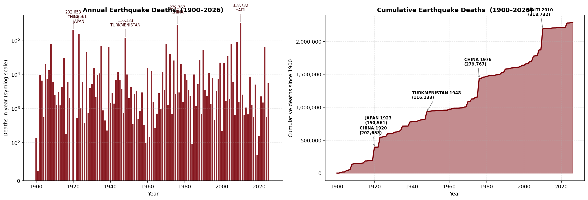
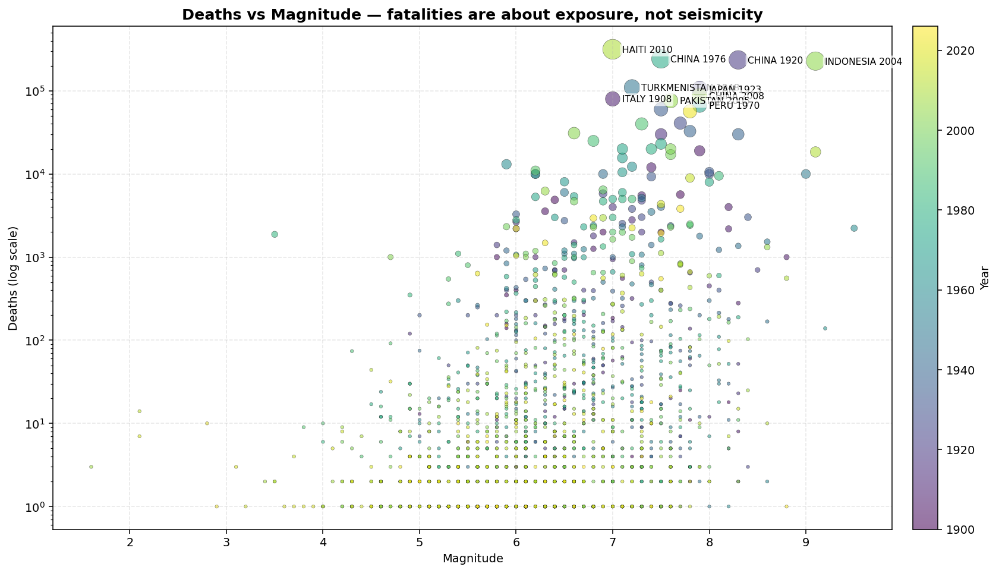

# Earthquakes

Pull the USGS M≥4.0 earthquake catalog into a local SQLite database, then explore it in a Jupyter notebook. One of 10 sibling repos analyzed together — see the [`correlations`](https://github.com/Biblejustin/correlations) hub for the cross-repo analysis.

## What it does

`fetch_quakes.py` queries the [USGS FDSN event service](https://earthquake.usgs.gov/fdsnws/event/1/) in yearly chunks, auto-splitting any year that exceeds the API's 20,000-result cap into months. Results land in `quakes.sqlite` (~110 MB for 1965–today, ~530k events). The fetcher is idempotent on event id and resumable: re-running only processes missing chunks, and the current year is always re-fetched.

`fetch_significant.py` adds fatality and damage data for significant earthquakes since 1900 from the NOAA NCEI Significant Earthquake Database, pulled via a [GitHub mirror](https://github.com/benjiao/significant-earthquakes) (through 2017) plus a local `recent_significant.tsv` for post-2017 events. Replace the latter with a fresh NOAA NCEI download when their API is reachable. Data lands in a `significant_quakes` table alongside the USGS catalog.

`earthquakes.ipynb` reads both tables and produces the nine plots below. Each is also written to `figures/` so you can browse them on GitHub without running the notebook.

## Sample output

### Magnitude vs. time


### Yearly counts by magnitude band

The trend line is fit on the post-2000 era only — once digital regional networks were fully online and M4 detection had largely stabilized. A full-span fit would mostly track network-coverage gains rather than seismicity, so it's omitted.

**Above vs. below the line:** A year whose bar sits *above* the dashed trend line had more catalogued quakes than the post-2000 average predicts; *below* means fewer. Most pre-2000 bars are far below the trend line because the catalog wasn't yet detecting M4 events globally. Post-2000 bars hug the line because that's the era the line is fit to.


### M≥7.0 yearly counts (the detection-bias control)

Global instrumentation has been complete for M7+ for ~125 years, so this band isn't affected by the same detection-improvement bias. If the apparent trend at M4 were real seismicity, this line would rise too. Both fits — long span (1900–today) and WWSSN era (1965–today) — come out essentially flat. The M4 trend is detection, not actual quakes.

**Above vs. below the line:** A year *above* the dashed trend had more M≥7 quakes than the long-run average; *below* had fewer. Standout above-trend years include 2010 (Chile + Haiti), 2011 (Tōhoku + multiple aftershocks), 1939, and 2004 (Sumatra). Sustained below-trend stretches like the mid-1980s are real quiet periods, not detection artifacts (the M7 catalog has been complete throughout).


### M≥7.0 trailing 12-month count

The calendar-year view above mixes a "what changed?" question with calendar-bin noise and a partial-year problem. The trailing 12-month count is a continuous sliding window: for every day in the catalog, how many M≥7 events occurred in the prior 365 days. Every plotted point represents a full year's observations, the series runs all the way to today, and you can read clustering events (1939, 2004–2011) and quiet stretches (mid-1950s) at a glance.

**Above vs. below the band:** The shaded ±1σ band shows the "normal" range of yearly counts. The line *inside* the band is at unremarkable levels (what you'd expect from year-to-year variation). The line *above* the band is a notable clustering period — significantly more M≥7 quakes than usual rolling through the catalog. The line *below* the band is a quiet stretch. The 1939 spike and 2004–2011 plateau punch above; the mid-1950s and the early 2020s sag below.


### Decadal intensity

A linear-trend fit answers "is the average rate ticking up?" — but if the pattern of interest is episodic rather than steady (clusters intensifying, peaks rising), the more relevant question is "are the peaks and totals per decade rising?" Two views:

- **Peak trailing-12-month count per decade** (left): how big was the worst cluster of each decade?
- **Cumulative seismic energy per decade** (right): expressed as the equivalent magnitude of one quake releasing the decade's total seismic moment. Because magnitude is logarithmic, this is dominated by the largest events of each decade and is a more honest "intensity" reading than count alone.



### Great-quake timing (M≥8.5)

Restricting to the truly great earthquakes — M≥8.5 — is the cleanest test for whether large quakes are arriving more frequently. The catalog has 17 such events since 1900.

- **Left**: cumulative count over time. A steepening curve means events are arriving faster; a straight line means a constant rate.
- **Right**: time gap between consecutive great quakes, with a 5-event rolling mean.

**Above vs. below the line:** If the left-panel cumulative staircase is *above* the constant-rate reference, great quakes have been arriving *faster* than the long-run average (busy stretch). *Below* the reference means they've been arriving *slower* (quiet stretch). The catalog shows two busy stretches above the line: the early-20th-C run (Andes/Aleutians cluster) and the 2004–2014 cluster (Sumatra, Chile, Tōhoku) — separated by a 50-year quiet stretch where the staircase falls well below the line.



### Human cost — earthquake fatalities

**Important: fatalities are not a measure of seismicity.** They measure where people happened to be living when the ground shook. A M6.0 under a megacity kills thousands; a M8.5 in the open ocean kills nobody. Trends in earthquake deaths over the 20th century are dominated by population growth, urbanization (~4× since 1900), building codes (or their absence) in seismically active regions, and warning systems — not by Earth's behavior. Read these plots as a *human-exposure* story.

About 2.28 million people have died in earthquakes since 1900 by recorded counts. The single deadliest years are dominated by individual catastrophic events — Haiti 2010 (~316k), Tangshan 1976 (~243k), Gansu 1920 (~200k), Tokyo/Yokohama 1923 (~143k).



### Deaths vs. magnitude

If lethality were just about seismic energy, this scatter would be a clean upward trend. It isn't — the vertical spread at any given magnitude is enormous. M7.0 events range from zero deaths (open ocean) to 316,000 (Haiti 2010, a city of 3M with poor building stock directly above a M7.0). The cleanest evidence that fatalities are about *where* and *what's built there*, not the seismic event itself.

**Above vs. below any imagined trend line:** Dots *above* the cloud of points at a given magnitude are events that killed *more* people than typical for that magnitude — usually because they struck a populated, poorly-built region (Haiti 2010 at M7.0 → 316k; Tangshan 1976 at M7.6 → 243k). Dots *below* are events that killed *fewer* than typical for that magnitude — usually offshore or remote (most M8+ Aleutians/South Sandwich events).



### Magnitude distribution

This is the classic Gutenberg-Richter plot: log-log survival function of magnitudes. The dashed line is the power-law fit on the tail (M≥6.5, where global detection is complete throughout the catalog).

**Above vs. below the line:** Dots *above* the dashed line at a given magnitude mean "more quakes at this magnitude than the Gutenberg-Richter scaling rule predicts" — an excess at that size. Dots *below* mean "fewer than predicted." The very-large tail (M8.5+) typically falls slightly below the line, reflecting the fact that the largest events are *even rarer* than the scaling rule expects — a finite-size upper cutoff in the physics. The small-end deviation below the line at M<4 is just the catalog completeness floor (we don't catch every M3).


## Why these specific cutoffs

The dates and magnitude thresholds in this project aren't arbitrary — each one is picked to match a real change in the global seismograph network's ability to detect quakes. Without those filters, you can't tell which "trends" are the Earth doing something different versus the catalog catching more events.

**Why start at 1965.** The World-Wide Standardized Seismograph Network (WWSSN) was deployed between 1961 and 1967 — about 120 stations across the globe, all running the same instruments at known calibrations. It was the first time M4-class events anywhere in the world had a real chance of being recorded by *somebody*. Before 1965, M4 and M5 events in remote regions (open ocean, polar areas, sparsely-stationed continents) routinely went unrecorded. The catalog technically goes back further, but pre-1965 numbers undercount reality so badly that putting them on the same plot as modern data would be misleading. 1965 is the earliest point where the M≥4 global rate is even roughly comparable across the span.

**Why 2000 is the "post-upgrade" cutoff.** Even after WWSSN, M4 detection kept improving. The biggest jump came in the late 1990s and around 2000, when USGS started ingesting feeds from many regional digital networks (the Advanced National Seismic System came online in 2000). The catalog roughly tripled — from ~5k events/yr in the late 1990s to ~14k/yr in the 2000s. That isn't more earthquakes; it's the same earthquakes finally getting recorded. After ~2000, M4 detection in seismically active regions is close to complete, and trend lines fit on this period are mostly about real seismicity rather than coverage gains. The notebook fits its M≥4 trend line on this post-2000 era for that reason.

**Why M≥7 is the control.** Large earthquakes radiate so much seismic energy that they're detected by *every* station on Earth, regardless of how dense the network is. M7+ events have essentially 100% global completeness back to ~1900, well before any of the network upgrades that affect M4 numbers. So the M≥7 yearly count is the cleanest available signal for the question "is the Earth becoming more seismically active?" — it isn't contaminated by detection improvements. The cutoff at 7 specifically is conservative; M≥6 is *probably* close to complete back to 1965, but M≥7 is unambiguously complete and gives a clean answer. In this catalog the M≥7 count averages ~14/yr with a slope of +0.05/yr — essentially flat. That's the evidence that the apparent M4 increase is the network, not the planet.

## Setup

```bash
python3 -m venv venv
source venv/bin/activate
pip install -r requirements.txt
```

## Fetch the data

```bash
python fetch_quakes.py        # USGS catalog: M≥4 from 1965 to today
python fetch_significant.py   # NOAA NCEI fatality data: 1900 to today
```

`fetch_quakes.py` defaults to M≥4.0, 1965 → today. Override with `--start-year`, `--end-year`, `--min-mag`, `--db`. Pre-1965 data is sparse globally; treat earlier years as undercounting reality.

`fetch_significant.py` pulls from the GitHub mirror (1900–2017) and reads `recent_significant.tsv` for post-2017 events. Use `--mirror-only` or `--local-only` to control sources. When NOAA NCEI's API is reachable, regenerate `recent_significant.tsv` from a fresh search export at https://www.ngdc.noaa.gov/hazel/view/Hazards/Earthquake/Search.

## Open the notebook

```bash
jupyter notebook earthquakes.ipynb
```

Re-executing the notebook refreshes the PNGs in `figures/` as a side effect.
