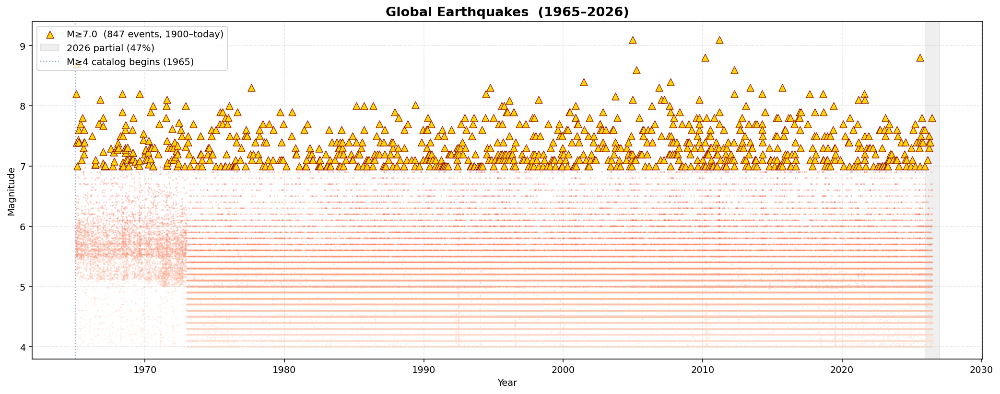
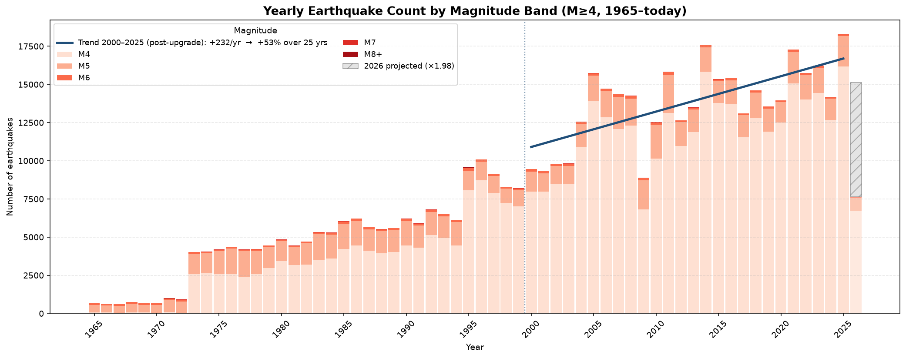
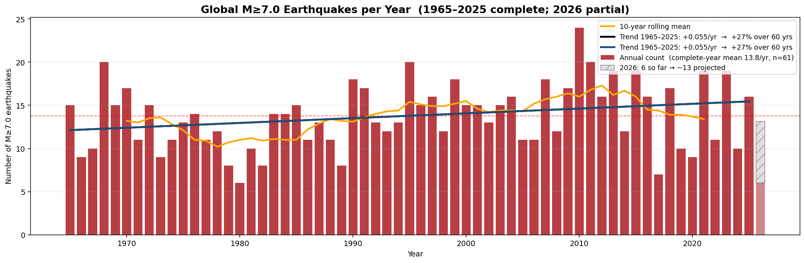
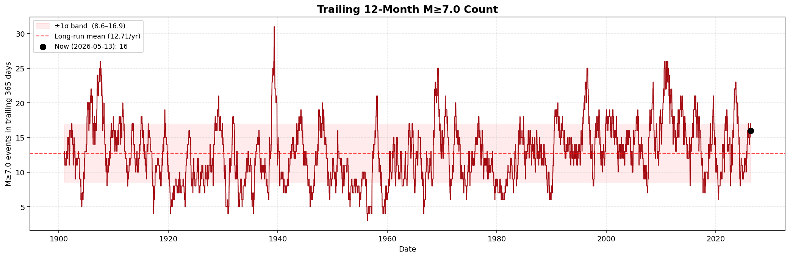
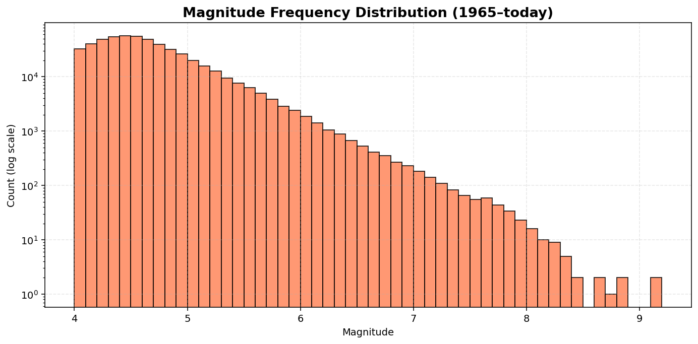

# Earthquakes

Pull the USGS M≥4.0 earthquake catalog into a local SQLite database, then explore it in a Jupyter notebook.

## What it does

`fetch_quakes.py` queries the [USGS FDSN event service](https://earthquake.usgs.gov/fdsnws/event/1/) in yearly chunks, auto-splitting any year that exceeds the API's 20,000-result cap into months. Results land in `quakes.sqlite` (~110 MB for 1965–today, ~530k events). The fetcher is idempotent on event id and resumable: re-running only processes missing chunks, and the current year is always re-fetched.

`earthquakes.ipynb` reads the database and produces the five plots below. Each is also written to `figures/` so you can browse them on GitHub without running the notebook.

## Sample output

### Magnitude vs. time



### Yearly counts by magnitude band

The trend line is fit on the post-2000 era only — once digital regional networks were fully online and M4 detection had largely stabilized. A full-span fit would mostly track network-coverage gains rather than seismicity, so it's omitted.



### M≥7.0 yearly counts (the detection-bias control)

Global instrumentation has been complete for M7+ for ~125 years, so this band isn't affected by the same detection-improvement bias. If the apparent trend at M4 were real seismicity, this line would rise too. Both fits — long span (1900–today) and WWSSN era (1965–today) — come out essentially flat. The M4 trend is detection, not actual quakes.



### M≥7.0 trailing 12-month count

The calendar-year view above mixes a "what changed?" question with calendar-bin noise and a partial-year problem. The trailing 12-month count is a continuous sliding window: for every day in the catalog, how many M≥7 events occurred in the prior 365 days. Every plotted point represents a full year's observations, the series runs all the way to today, and you can read clustering events (1939, 2004–2011) and quiet stretches (mid-1950s) at a glance. The shaded band is ±1σ of the yearly counts — values inside are unremarkable, outside are notable.



### Magnitude distribution



## Why these specific cutoffs

The dates and magnitude thresholds in this project aren't arbitrary — each one is picked to match a real change in the global seismograph network's ability to detect quakes. Without those filters, you can't tell which "trends" are the Earth doing something different versus the catalog catching more events.

**Why start at 1965.** The World-Wide Standardized Seismograph Network (WWSSN) was deployed between 1961 and 1967 — about 120 stations across the globe, all running the same instruments at known calibrations. It was the first time M4-class events anywhere in the world had a real chance of being recorded by *somebody*. Before 1965, M4 and M5 events in remote regions (open ocean, polar areas, sparsely-stationed continents) routinely went unrecorded. The catalog technically goes back further, but pre-1965 numbers undercount reality so badly that putting them on the same plot as modern data would be misleading. 1965 is the earliest point where the M≥4 global rate is even roughly comparable across the span.

**Why 2000 is the "post-upgrade" cutoff.** Even after WWSSN, M4 detection kept improving. The biggest jump came in the late 1990s and around 2000, when USGS started ingesting feeds from many regional digital networks (the Advanced National Seismic System came online in 2000). The catalog roughly tripled — from ~5k events/yr in the late 1990s to ~14k/yr in the 2000s. That isn't more earthquakes; it's the same earthquakes finally getting recorded. After ~2000, M4 detection in seismically active regions is close to complete, and trend lines fit on this period are mostly about real seismicity rather than coverage gains. The notebook fits its M≥4 trend line on this post-2000 era for that reason.

**Why M≥7 is the control.** Large earthquakes radiate so much seismic energy that they're detected by *every* station on Earth, regardless of how dense the network is. M7+ events have essentially 100% global completeness back to ~1900, well before any of the network upgrades that affect M4 numbers. So the M≥7 yearly count is the cleanest available signal for the question "is the Earth becoming more seismically active?" — it isn't contaminated by detection improvements. The cutoff at 7 specifically is conservative; M≥6 is *probably* close to complete back to 1965, but M≥7 is unambiguously complete and gives a clean answer. In this catalog the M≥7 count averages ~14/yr with a slope of +0.05/yr — essentially flat. That's the evidence that the apparent M4 increase is the network, not the planet.

## Setup

```bash
python3 -m venv venv
source venv/bin/activate
pip install -r requirements.txt
```

## Fetch the data

```bash
python fetch_quakes.py
```

Defaults to M≥4.0, 1965 → today. Override with `--start-year`, `--end-year`, `--min-mag`, `--db`. Pre-1965 data is sparse globally; treat earlier years as undercounting reality.

## Open the notebook

```bash
jupyter notebook earthquakes.ipynb
```

Re-executing the notebook refreshes the PNGs in `figures/` as a side effect.
